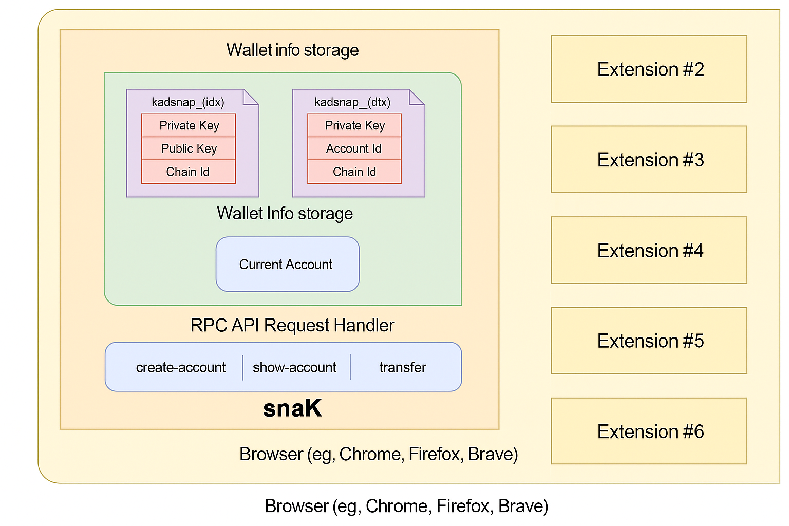

# Snap Architecture

What does snaK look like under the hood?

---

One of the primary benefits of developing and using a Snap like **snaK** in your application is that it inherits the **security model of MetaMask**. Each Snap runs in its **own isolated execution environment**, completely sandboxed from other Snaps and browser extensions.

In the case of snaK, this isolation is crucial because the Snap manages **private keys for Kadena accounts** derived from the user's MetaMask seed phrase or imported independently. The Snap exposes a **minimal set of RPC APIs**, such as:

- `create-account`
- `show-account`
- `transfer`

These functions allow secure interaction with the **Chainweb network** while keeping private key material inaccessible to the application.

---

## Secure Storage and Execution

Within snaK, key data such as:

- `Private Key`
- `Public Key`
- `Account ID`
- `Chain ID`

are stored in internal Snap state. Only the Snap has access to this information. The **RPC API handler** gates all external access and enforces capability-based restrictions.

The Snap is also responsible for managing the **current account context**, ensuring actions are executed against the correct wallet index and chain ID.

---

## Why it Matters

This architecture ensures that:

- No external dApp or Snap can access your private keys.
- All transactions must be explicitly signed via the Snap interface.
- The Snap can support multiple chain IDs in Kadena’s multi-chain architecture.
- Users retain full control over account selection and transaction authorization.

By leveraging MetaMask's Snap framework, **snaK** ensures high-security interaction with the Kadena blockchain, giving developers and users a reliable tool for integrating Web3 functionality with native wallet capabilities.
