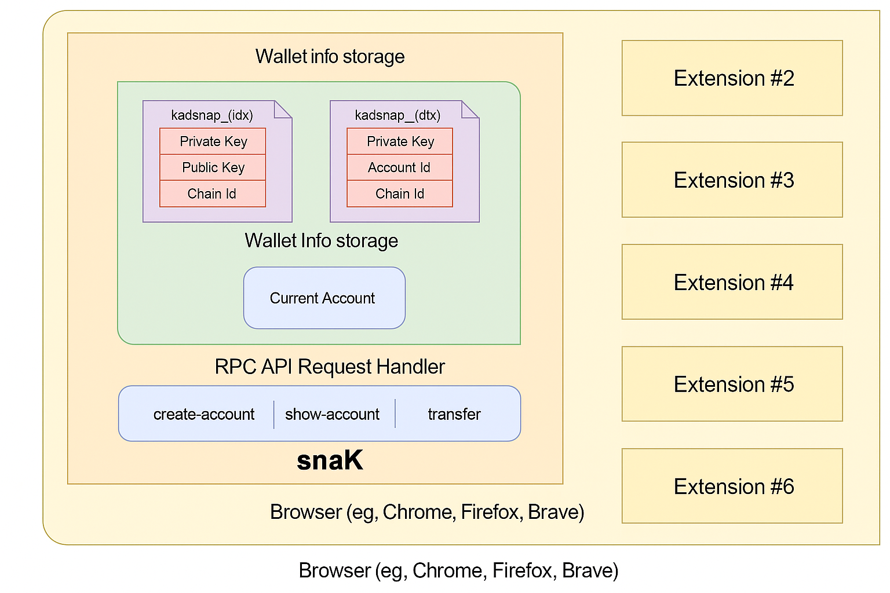

# snaK Wallet: Kadena's MetaMask Snap

The snaK wallet is a MetaMask Snap that enables Kadena (KDA) blockchain functionality within MetaMask. This document provides an overview of its features and usage.

## Overview

The snaK wallet allows users to:
- Manage KDA accounts
- Send and receive KDA tokens
- Interact with Kadena's blockchain networks
- Access testnet faucets

## Getting Started

### Installation
1. Install MetaMask (if not already installed)
2. [Connect the snaK Snap](user-guide/connect.md)
3. [Approve required permissions](user-guide/approve-permissions.md)

### Key Features
- **Network Switching**: [Switch between Kadena networks](user-guide/switch-network.md)
- **Transactions**: [Send KDA tokens](user-guide/send-kda.md)
- **Testnet Support**: [Use the faucet](user-guide/faucet.md) to get testnet tokens

## Architecture

For technical details about how the snaK wallet works, see the [architecture documentation](architecture.md).

## Developer Resources

If you're a developer looking to integrate with or build upon the snaK wallet:
- [SDK Overview](sdk.md)
- [Setup Instructions](sdk/setup-project.md)
- [Integration Guide](sdk/integrate-snap.md)

## FAQs

Common questions and troubleshooting can be found in the [FAQs section](faqs.md).

## Support

For additional help, please refer to the [full documentation](SUMMARY.md).
