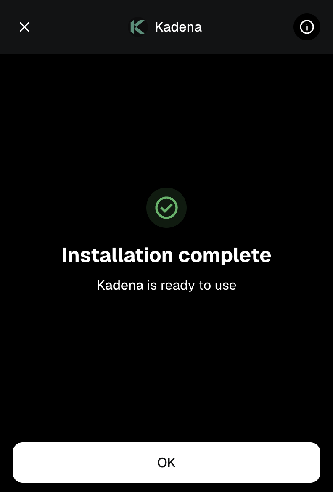

# Kadena Snap User Guide

> **Note:** The Kadena Snap is only available in the MetaMask browser extension. Users must switch to desktop to interact with the Kadena Snap.

This guide walks you through the steps to connect your MetaMask wallet to the Kadena Snap, install it, approve permissions, and perform basic operations like switching networks and sending $KDA.

---

## 1. Connect to Kadena Snap

When visiting a dApp that uses Kadena Snap, you’ll be prompted to connect your MetaMask wallet.

Your Kadena account will be derived from your **MetaMask Secret Recovery Phrase**.

---

## 2. Approve the Connection Request

MetaMask will display a connection request, asking you to approve the origin (e.g., `http://localhost:8080`).

Click **"Connect"** to proceed.

---

## 3. Approve Permissions to Add Snap

You’ll now be asked to install the Kadena Snap, which includes requesting permissions:

- Manage Kadena accounts
- Display dialog windows in MetaMask
- Display a custom screen

Click **"Confirm"** to continue.

---

## 4. Confirm Final Permissions

MetaMask may show a final prompt to **"Proceed with caution"**, requesting permission to manage your Kadena accounts.

Check the box to **Install Kadena** and click **Confirm** to proceed.

---

## 5. Snap Installed Successfully

Once installed, MetaMask will display confirmation that the Kadena Snap is ready to use.

Click **OK** to return to the dApp.

---

## 6. Switch to Kadena Network (Optional)

If the dApp requires you to use the **Kadena Testnet**, you’ll be prompted to approve the network switch.

Click **Approve** to allow switching to the testnet.

---

## 7. Fund Your Account (Using Faucet)

To perform any transaction, your new account needs $KDA. Use the official faucet:

**🔗 [Kadena Faucet](https://tools.kadena.io/faucet/new)**

Once funded, you’ll see a screen like this while a transaction is being processed:

---

## 8. Sending KDA

After funding your account, you can send $KDA to other accounts or perform cross-chain transfers using the Snap interface.

- **From Account**: Your Kadena address
- **To account**: Recipient address
- **To chain**: Select destination chain (e.g., Chain 1–20)
- **Amount**: Amount of $KDA
- **Gas Fee**: Usually prefilled

Click **Send** to broadcast your transaction.

---

## Done!

You're now ready to interact with Kadena natively from MetaMask via the Kadena Snap. 🚀
