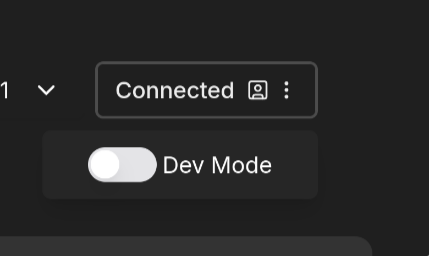
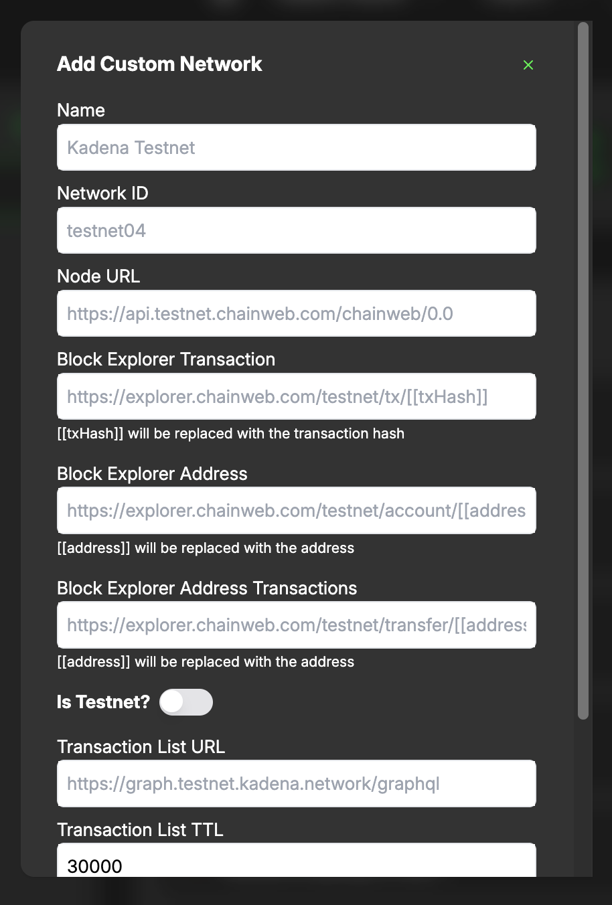
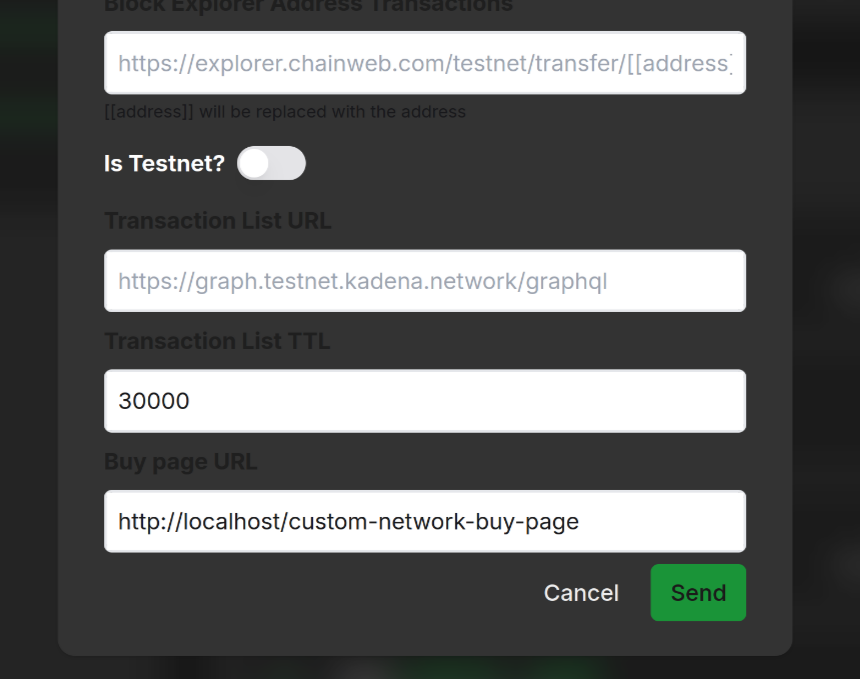
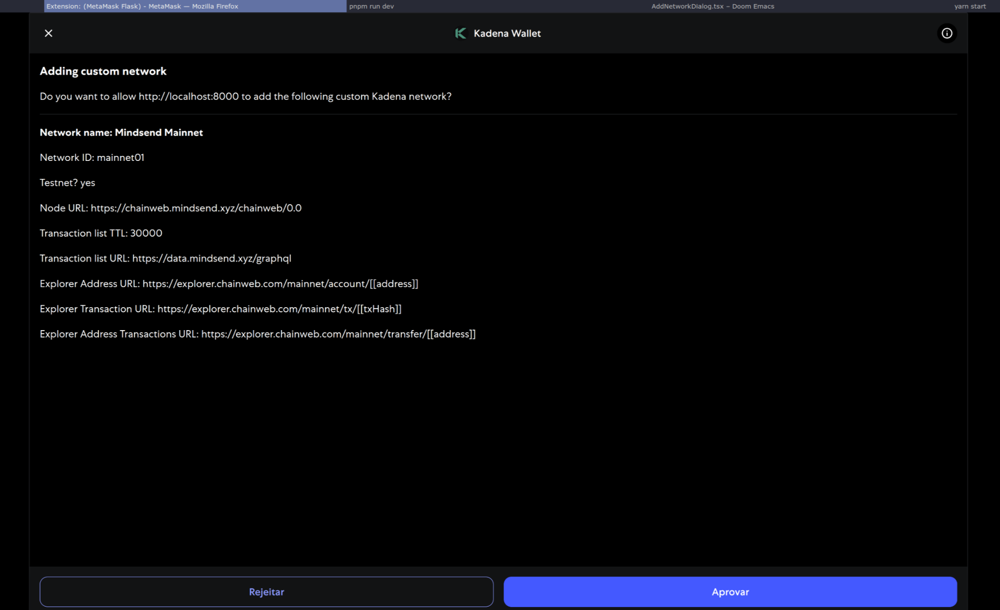

# Add a Custom Network on snaK

> ⚠️ To add networks, **Dev Mode** must be enabled. Without it, the "Add Network" button is hidden.

---

## 1. Enable Developer Mode

1. Open snaK.
2. Toggle **Dev Mode** ON (top-right of the app).

---

## 2. Add Custom Network

1. Open the network dropdown.
2. Click **Add Network**.
3. Fill in the fields:

| Field                             | Example                                             |
| --------------------------------- | -------------------------------------------------- |
| **Name**                          | Mindsend Mainnet                                   |
| **Network ID**                    | `mainnet01`                                          |
| **Node URL**                      | `https://chainweb.mindsend.xyz/chainweb/0.0`         |
| **Explorer Transaction URL**      | `https://explorer.chainweb.com/mainnet/tx/[[txHash]]`|
| **Explorer Address URL**          | `https://explorer.chainweb.com/mainnet/account/[[address]]`|
| **Explorer Address Transactions** | `https://explorer.chainweb.com/mainnet/transfer/[[address]]`|
| **Is Testnet?**                   | Enable if it's a testnet                           |
| **Transaction List URL**          | `https://graph.kadena.network/graphql`               |
| **Transaction List TTL**          | 30000                                              |
| **Buy Page URL**                  | *(Optional)*                                       |

3. Click **Send**.
4. Approve the request in the popup.

---

✅ Your network is now available in the dropdown.
