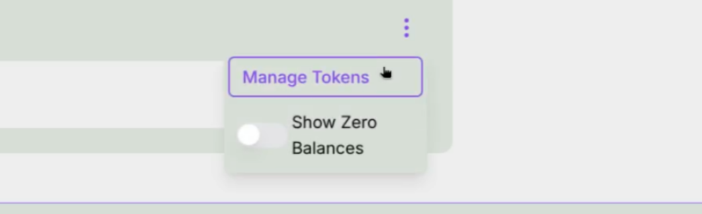
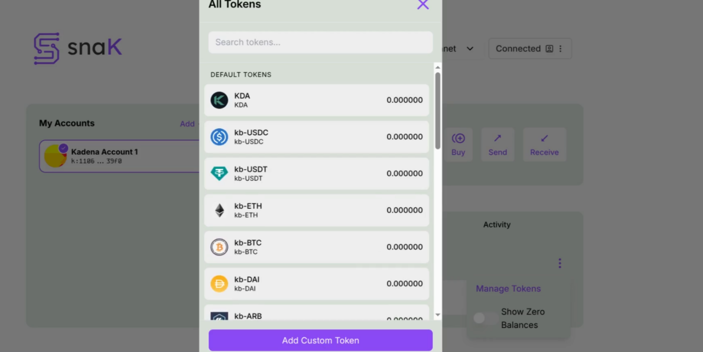
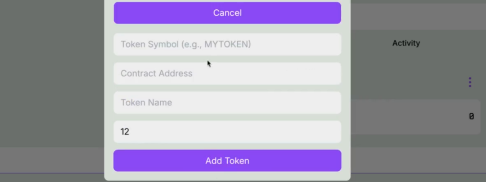
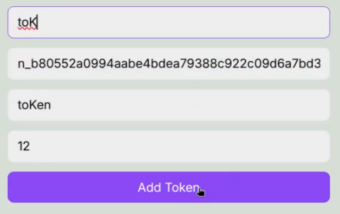

# How to Add Custom Tokens

This guide explains how to add custom tokens to your wallet interface.

---

## Step 1 — Open the Token Manager

Click on the three‑dot menu in the wallet and select Manage Tokens.

---

## Step 2 — View the Token List

You will see the list of default tokens available in the wallet. At the bottom of this screen, click Add Custom Token.

---

## Step 3 — Open the Add Token Dialog

A dialog will appear asking you to provide details about your token.

---

## Step 4 — Fill in Token Information

Enter the following information:
- Token Symbol (e.g., `MYTOKEN`)
- Contract Address (the token contract’s unique identifier)
- Token Name (readable name for the token)
- Decimals (the token’s precision, e.g., 12)

After filling in the fields, click Add Token.

Example (as shown below):
- Token Symbol: `toK`
- Contract Address: `n_b80552a0994aabe4bdea79388c922c09d6a7bd35.tok`
- Token Name: `toKen`
- Decimals: `12`

---

## Done!

Your custom token will now appear in the wallet’s token list and can be selected when sending tokens.
