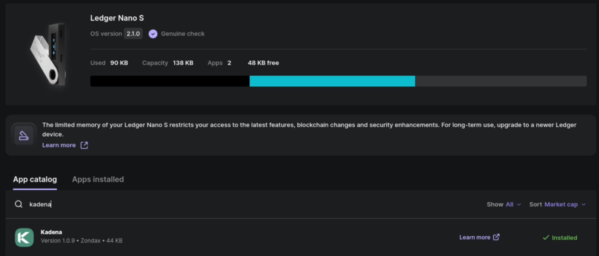
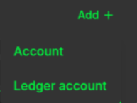
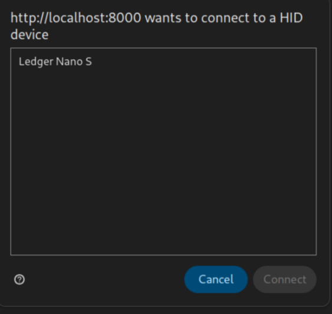

# Using Ledger with snaK

This guide walks you through how to connect and use your **Ledger** Hardware Wallet with snaK.

> ✅ Tested with **Ledger Nano S**  
> 🔒 Requires HID permission to be granted to your browser

🛠️ snaK provides similar functionality to the official [Kadena Transfer tool](https://transfer.chainweb.com), but integrated directly into your wallet flow — no extra tabs or context switching required.

---

## Browser Compatibility

> `navigator.hid` is required for Ledger support. Only available in **HTTPS secure contexts** and supported by Chromium-based **desktop browsers**.

| Browser             | Support |
|---------------------|---------|
| **Desktop Browsers**|         |
| Chrome              | ✅ 89+  |
| Edge                | ✅ 89+  |
| Firefox             | ❌ No   |
| Opera               | ✅ 75+  |
| Safari              | ❌ No   |
| **Mobile Browsers** |         |
| Chrome Android      | ❌ No   |
| Firefox Android     | ❌ No   |
| Opera Android       | ❌ No   |
| Safari iOS          | ❌ No   |
| Samsung Internet    | ❌ No   |
| WebView Android     | ❌ No   |
| **Other Platforms** |         |
| Deno                | ❓ ?    |
| Node.js             | ❌ No   |

---

## 1. Install Kadena App on Ledger

1. Open **Ledger Live**.
2. Go to **My Ledger**.
3. Search for **Kadena** and install the app.

---

## 2. Open Kadena App on Ledger

After installation:

- Unlock your Ledger.
- Navigate to and **open the Kadena app** on the device.
- You should see the message: `Kadena is ready`.

> 📌 If you haven't opened the app, snaK will prompt you to open it on your Ledger.

---

## 3. Add a Ledger Account in snaK

1. In snaK, click **Add +** in the sidebar.
2. Select **Ledger account**.

---

## 4. Grant HID Permission

If it's your first time connecting a Ledger:

1. You’ll see a browser prompt asking for permission to connect to a HID device.
2. Select your Ledger device and click **Connect**.

---

## 5. You're Done

Your Ledger account is now added and ready to use! 🎉  
You can now sign and send transactions from this account as described in other guides (e.g., [Send KDA](./send-kda.md)).

---

## Official Ledger Guide

For a detailed step-by-step guide from Ledger (including how to use Kadena Transfer), check out:

📄 [Ledger’s official Kadena guide](https://support.ledger.com/article/7415959614109-zd?redirect=false)

This includes installation instructions and general advice for managing KDA safely.

---

## Troubleshooting

- **Prompt to install MetaMask even when it's already installed?**  
  Check if you have other wallets (like **Koala Wallet**) interfering with `window.ethereum`.

---

## Additional Resources

- 🔑 Keys are derived the same way as in:  
  [https://transfer.chainweb.com/transactions/transfer](https://transfer.chainweb.com/transactions/transfer)

- 🧭 Ledger Quickstart:  
  [https://www.ledger.com/start](https://www.ledger.com/start)

---

