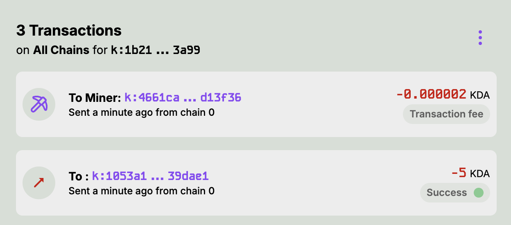
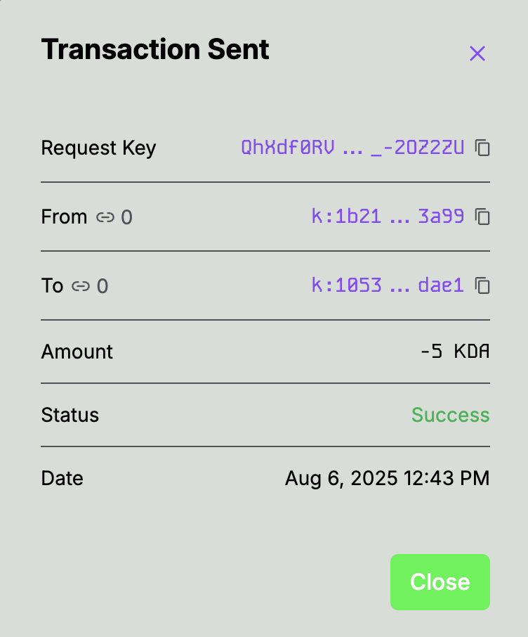

# Signing Transactions

To complete a transaction, you must review and approve the signature request with the Kadena Snap in the MetaMask popup.

After you have reviewed the transaction signature request, select Approve.

If the transaction is approved and successful, you will see this transaction in your Transaction Log.

This displays both the -5 KDA that was sent and the gas fee paid. You can view the transaction on the block explorer by clicking directly on a transaction. A popup will also show on the snaK interface with more details about your transaction.

Select Close to return to the snaK UI
