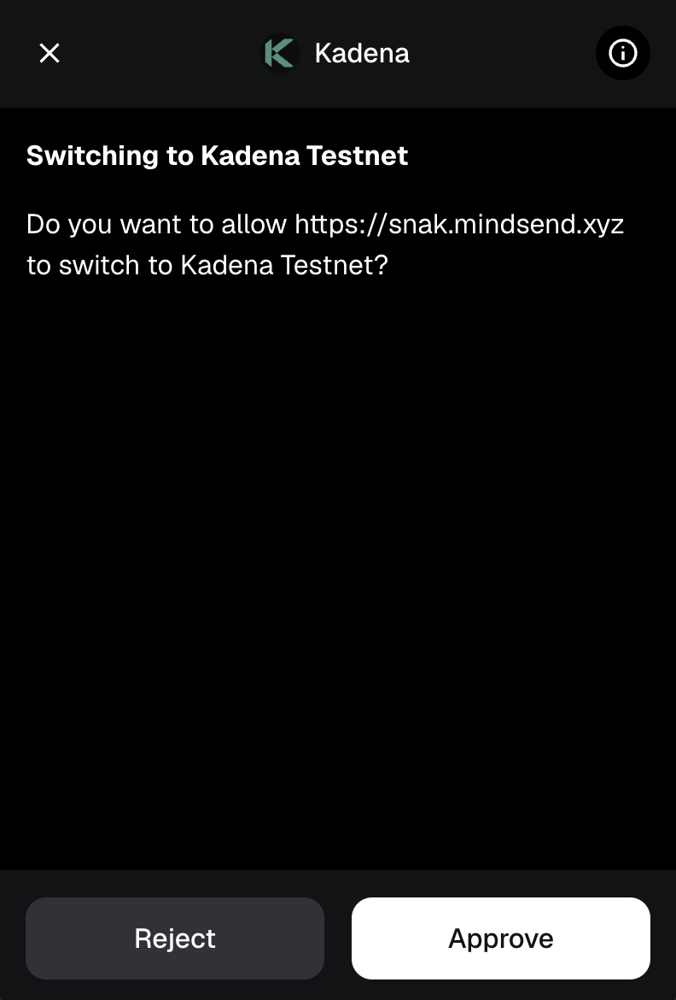

# Switching Networks (Optional)

If the dApp requires you to use the **Kadena Testnet**, you’ll be prompted to approve the network switch.

Click **Aprovar** (Approve) to allow switching to the testnet.
